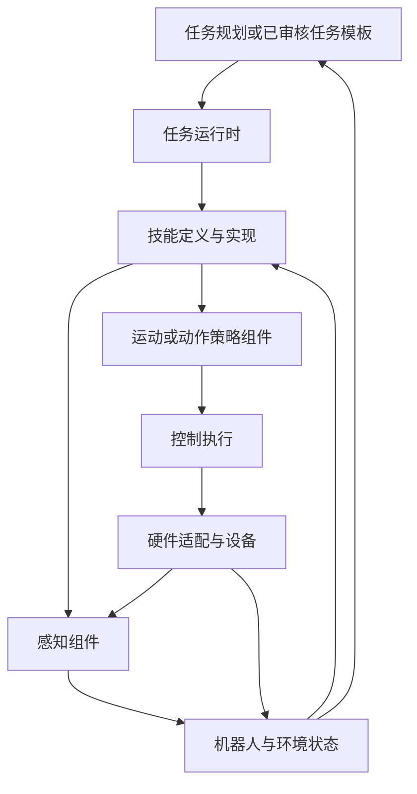

# 架构与术语

## 设计目标

上层可更换传统或模型任务规划，下层可更换设备，中间复用技能定义及经过验证的技能实现。初期验证扩展机制，不实现特定模型、真实硬件或通用机器人算法。

## 技能与组件的判断规则

**技能对可请求、可监控、可验收的目标行为负责；组件提供实现这些行为的技术功能。** 这是本仓库约定，不意味着所有第三方项目都使用相同术语。

| 内容 | 定位 | 原因 |
|---|---|---|
| 6D 位姿估计器 | 感知组件 | 计算测量，不负责整个定位任务 |
| 定位指定物体并获得有效测量 | 技能 | 检查对象、有效性、时效和坐标系 |
| MoveIt 2 | 运动子系统实现来源 | 提供运动规划、场景和执行集成 |
| MoveIt Task Constructor | 技能内部的多阶段操作规划组件 | 组织运动子问题，非全局任务调度器 |
| ros2_control | 控制和硬件抽象框架 | 连接控制器、硬件组件和资源接口 |
| 力/阻抗/导纳控制器 | 控制组件 | 执行本地控制规律 |
| 在约束下插装并验证到位 | 技能 | 组织感知、运动、接触控制和验收 |
| VLA 模型推理 | 动作策略组件 | 产生动作，需适配观测和执行端 |
| LLM/VLM 子任务推理 | 任务规划实现 | 产生技能级任务计划 |
| 相机/机械臂厂商 SDK | 适配器依赖 | 处理具体设备协议 |

一个 ROS Action 不自动等于技能；一个 BT 节点不自动等于 ROS 节点；组件也不自动等于 Composable Node。技能可调用一个组件、多个组件或子技能。持续技能须定义维持条件及停止确认。

## v0 代码映射

| 概念 | 实现 |
|---|---|
| 技能定义 | `robot_core::SkillDefinition`，参数、文字条件及目标语义 |
| 技能实现 | `Skill` + 工厂；`Locate` / `Manipulate` 为 mock 场景实现 |
| 技能实现选择 | `Skills` 中的 `(skill_id, implementation_id)`，每种实现独立声明组件依赖和独占角色 |
| 组件注册与角色绑定 | `Components`、`Bindings`，类型和接口版本检查 |
| 执行生命周期 | `Session`，非阻塞 start/tick/cancel |
| 资源所有权 | `Resources`，按物理资源 ID 独占 |
| 世界状态 | `WorldState`，仅保存示例观测；不能当作完整世界模型 |
| 任务执行 | BehaviorTree.CPP `SkillNode` + ROS `RuntimeNode` |

示例 `ObjectLocator` 和 `Manipulator` 是用于证明分层的最小类型化契约，不是生产机械臂、6D 感知或 VLA 的最终接口。未来应增加专用类型，不用无类型字符串字典承载轨迹和传感器数据。

## 依赖方向与实时边界

核心库不依赖 rclcpp、BehaviorTree.CPP、MoveIt 或任何模型 SDK。ROS/BT 适配层依赖核心。具体技能依赖组件契约，不依赖某个厂商。

任务运行时负责技能级资源；控制框架负责具体指令接口资源。两个层级应映射到同一物理设备身份，而不是互相替代。多个进程/机器人需要更完整的资源权威服务，v0 没有实现。

高频力控、轨迹跟踪和硬件保护保持在控制层。ROS、Python 或模型推理服务不自动提供实时保证。当前 timer 只是任务轮询，不是伺服控制循环。

环境状态需保留观测来源、坐标系、时间和质量；执行期不能把计划的预期效果直接写成观测事实。MoveIt PlanningScene 应作为运动规划视图，与世界状态同步，而不是任意多个模块互相覆盖的数据库。

## 复用边界

- [BehaviorTree.CPP](https://www.behaviortree.dev/docs/ros2_integration/)：复用执行引擎，当前用 StatefulActionNode 连接核心会话；未来远程技能可通过 BehaviorTree.ROS2。
- [MoveIt 2](https://moveit.picknik.ai/main/doc/concepts/move_group.html)：将规划和执行能力绑定到具体技能实现。
- [ros2_control](https://control.ros.org/jazzy/doc/getting_started/getting_started.html#architecture)：按设备适用性接入，不重复实现其控制器管理。
- [SkiROS2](https://github.com/RobotLabLTH/SkiROS2)：技能条件、世界模型和任务规划的设计参照；采用前须单独验证 ROS 2 分支和兼容性。
- [PlanSys2](https://plansys2.github.io/)：未来符号任务规划候选，避免与本运行时产生两个控制权所有者。

当前没有引入这些可选大依赖，也没有宣称已兼容任意机器人或模型。
