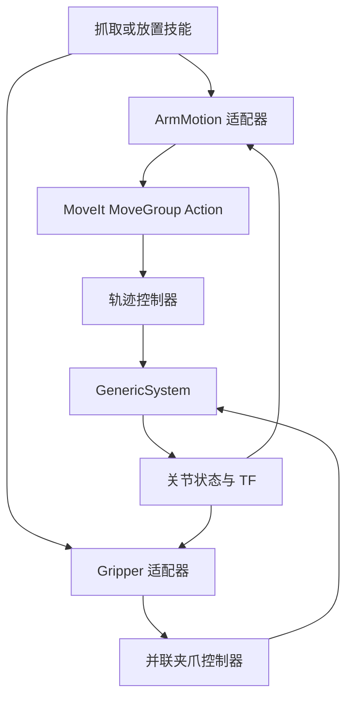

# ROS 后端与 Panda 示例

## 数据与控制链

`robot_core` 不依赖 ROS。`robot_ros_adapters` 承担 ROS 消息与核心类型的转换，技能的资源、停止和验收规则不随后端改变。

## 默认配置

| 内容 | 默认值 |
|---|---|
| 运动 Action | `/move_action`，`moveit_msgs/action/MoveGroup` |
| 夹爪 Action | `/panda_hand_controller/gripper_cmd`，`control_msgs/action/ParallelGripperCommand` |
| 规划组 / 基座 / 末端 | `panda_arm` / `panda_link0` / `panda_hand` |
| 控制器反馈 | `/joint_states`，关节位置与速度；缺失速度不能确认停止 |
| 仿真夹持证据 | `/panda/grasp_contact_stamped` (`robot_interfaces/GraspContact` schema v2)，区分双指、单指、无接触与未知；旧 `/panda/grasp_contact` Bool 仅供诊断，不可用于释放验收 |
| Panda 单指位置换算 | 开口宽度 = 单指关节位移 × 2 |
| 速度 / 加速度缩放 | 0.2 / 0.2 |
| 单技能 / 停止确认超时 | 30 s / 5 s |

运行时默认 `backend=mock`；Panda 示例显式设置 `backend=panda_ros`、`ros_backend_enabled=true`、`simulation_only=true`。示例 launch 固定 `mock_components`，不提供真实驱动选择参数。机器人身份/控制端点属于适配器配置；修改末端型号或控制器时，必须同时检查语义、关节顺序与接口版本。

5A 将对象/目标位姿移至 `runtime.yaml` 的 `entities.<id>.pose`，用 `object_ids/target_ids` 声明允许的实体，用 `task_names/tasks.<name>.*` 选择任务别名。Panda 和纯 mock 复用同一个配置定位组件，示例包含第二组对象/目标和 `transfer_two` 别名。目录入口与配置规则见 [技能目录与任务配置](task_catalog.md)。这些位姿仍为合成动作目标，没有视觉检测或接触几何。

## 反馈与取消

Action 客户端全部异步，由单线程 executor 串行推进。停止可以发生在 goal 被服务器接受之前；客户端记住该请求，在接受回调中立即请求取消。收到取消接受响应后仍等待终态结果及有效反馈。

位姿来自 TF，停止状态来自相关关节的测量速度。源 ROS 时间戳先校验，再转换为单调时钟年龄；重新查询缓存不会刷新测量时间。技能要求在观察到动作终态之后再收到有效停止测量，避免用动作开始前的静止样本解锁。

夹爪到位不会自动表示抓稳物体。示例的 `simulation_grasp_detection=true` 根据模拟开口与命令产生合成夹持信号，仅证明软件流程。真实接入需要接触/夹持传感器或专用结果验证；GenericSystem 的位置控制不提供实际力限制或接触模型。

## 验证范围

`scripts/test_panda.py` 启动真实 MoveIt、ros2_control、状态发布器和本运行时，验证重复执行 pick/place、任务超时后停止，以及资源释放后的再次执行。全程使用模拟硬件，不接实机。

测试同时检查子进程退出：段错误、子进程异常退出或强制清理会使 CI 失败。Jazzy 示例给 `move_group` 单独预加载 `moveit_simple_controller_manager` 库，让插件中的 Action 客户端控制块在回调组析构前仍有有效代码地址；这是 Linux 示例的退出兼容措施，不改变规划/执行接口。其依据为本次退出调用栈及 [MoveIt 上游相关问题](https://github.com/moveit/moveit2/issues/1597)，当前不宣称已经修复所有上游析构问题。

本示例证明运动规划和控制链路能够复用；没有验证真实抓稳、物体识别、放置到托盘、标定精度或硬件保护。真实接入前应补充独立执行许可组件、标定/TF、设备停止确认、接触反馈与现场恢复规则。技能 release 成功只保存推断放置候选，物体位置需要感知重新确认。

## 官方接口参照

- [MoveGroup Action](https://github.com/moveit/moveit_msgs/blob/ros2/action/MoveGroup.action)
- [ParallelGripperCommand Action](https://github.com/ros-controls/control_msgs/blob/jazzy/control_msgs/action/ParallelGripperCommand.action)
- [ros2_control GenericSystem](https://control.ros.org/jazzy/doc/ros2_control/hardware_interface/doc/mock_components_userdoc.html)
- [MoveIt Panda 资源配置](https://github.com/moveit/moveit_resources/tree/ros2/panda_moveit_config)
